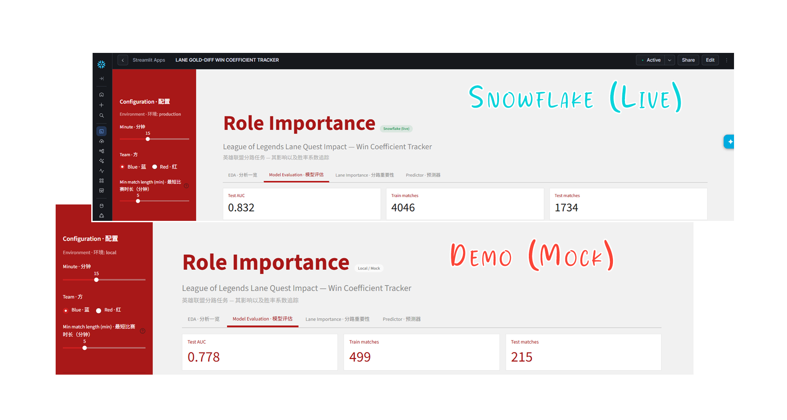
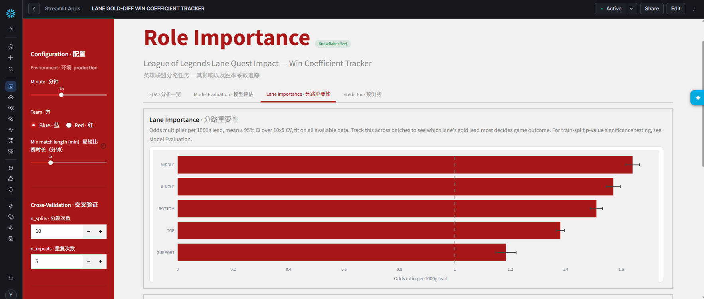
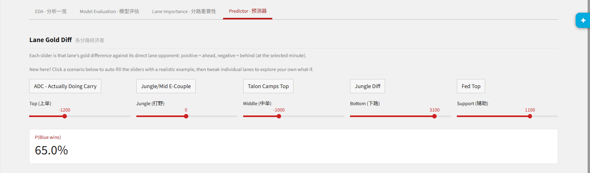
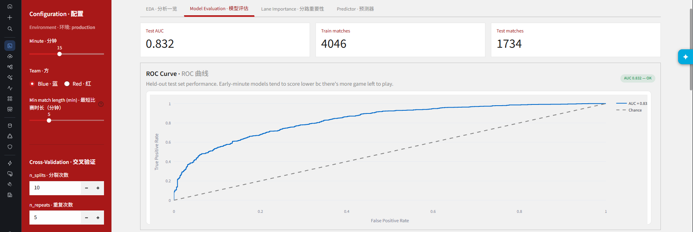
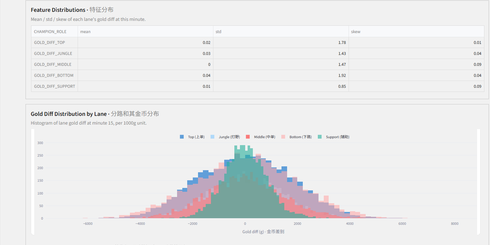

# Role Importance

### Play with the live demo here: [league-sf-role-importance.streamlit.app](https://league-sf-role-importance.streamlit.app/) 

### Or visit the parent pipeline: [github.com/TotoriYoyori/league-snowflake](https://github.com/TotoriYoyori/league-snowflake)

A simple logistic regression Streamlit app. Observe how each lane's gold diff at a chosen match minute affect the total 
win probability for your LoL match. 
> *Snowflake version is deployed as a warehouse-runtime app, capable of using live, continuous data from the 
pipeline. Demo versions uses a small subset of sample data, hosted on Streamlit Cloud.*



----
## Project structure

```
LeagueSnowflakeRoleImportance/
├── streamlit_app.py     # entry point
├── settings.py          # config
├── src/
│   ├── query.py         # live Snowflake query
│   ├── data.py          # all data procurement for ui display, and caching
│   ├── mock.py          # local CSV mock data loading
│   ├── model/           # pure ds prep/eda/evaluation/importance/predictor functions
│   └── ui/              # renders: theme (palette + CSS) and components (shared chrome)
├── assets/
│   └── sample_data/     # CSV sample, used whenever running locally
```
----
## Gallery



> *Which lane's gold lead most decides the game right now? (Lane Importance tab)*



> *At 15 minutes, our top and mid is losing, but our bottom lane is winning. What is our win probability? (Predictor tab)*



> *Is the model even any good at minute 15? (Model Evaluation tab)*



> *What does the underlying data look like? (EDA tab)*

Model, in short:

- **Features:** each lane's gold diff at a chosen minute 
(`GOLD_DIFF_TOP` / `GOLD_DIFF_JUNGLE` / `GOLD_DIFF_MIDDLE` / `GOLD_DIFF_BOTTOM` / `GOLD_DIFF_SUPPORT`), scaled
to per-1,000g units (scale up small p, and also aid with general interpretation).
- **Target:** did the selected team win (0/1 on `{TEAM}_WIN`)
- Early-minute models tend to score lower on AUC than late-minute ones, there's just more game left to be  played. 
The Model Evaluation tab's pill flags when to trust a given minute's coefficients less.

----
## Known limitations

- No persisted history: every session recomputes fresh off the same static data. Nothing snapshots a
  patch's coefficients for later comparison, so "patch over patch" tracking today means re-running this
  app on each patch's data and comparing manually (future additions)
- One fixed 70/30 train/test split for the Model Evaluation tab, not repeated or cross-validated (Lane
  Importance's CV stability check is separate and only covers the full-data fit).
- Not yet capping live version amount of data used. The live version will in theory use all available data.

> Original source: [LoL Match Intervals: 2 Million In-Game Snapshots](https://www.kaggle.com/datasets/nathansmallcalder/league-of-legends-match-interval-snapshots-2026)

----
**Stacks used:** Python | SQL | NumPy | Pandas | Scikit-Learn | Statsmodels | 
Plotly | Pydantic | Streamlit | Snowflake